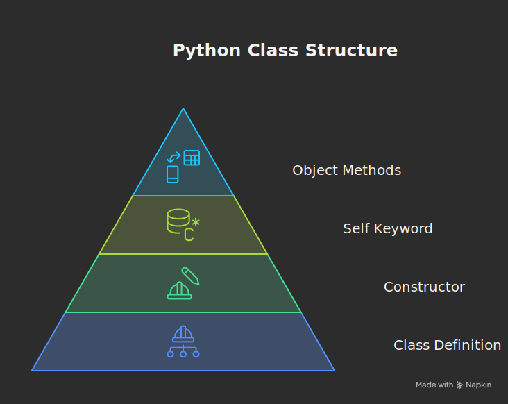
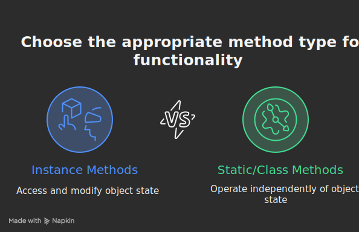
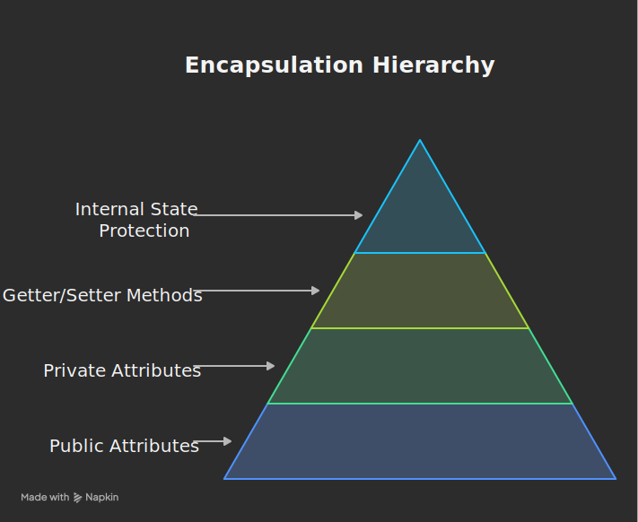
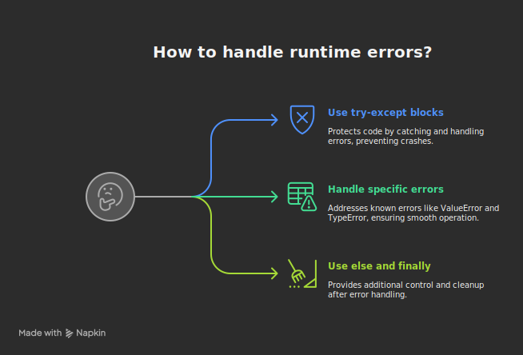
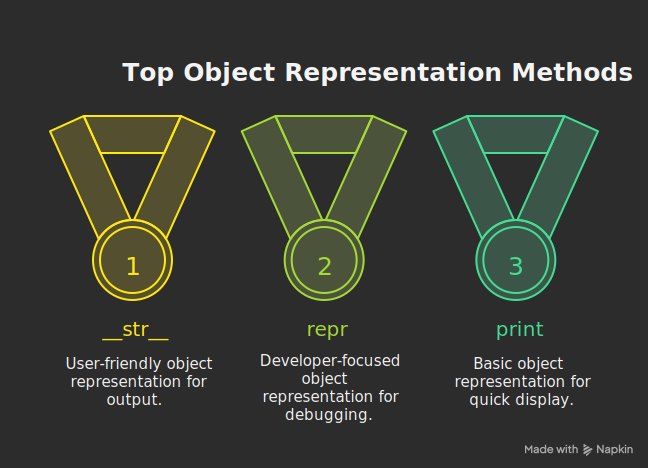
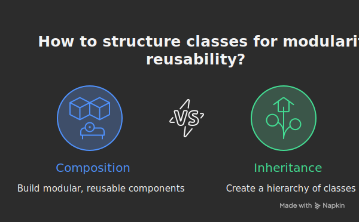

# 🕒 Hour 2: Classes, OOP & Error Handling

👨‍💻 **Goal**: Understand object-oriented programming, write reusable classes, and handle errors cleanly.

---

### ✅ 1. Introduction to Classes (15 mins)
* **Topics:**
    * Define a class using `class` keyword
    * Constructor: `__init__`
    * Use `self` to store data
    * Instantiate and call methods on an object
* **Summary:** Learn to group logic and data using Python classes and the `__init__` constructor.
* **Prompt:** "Classes let you model real-world things using attributes and behaviors."
* **Example:** [Run `python 01_intro_classes.py`](./01_intro_classes.py)


---

### ✅ 2. Instance vs Class Methods (10 mins)
* **Topics:**
    * Define methods using `def` and `self`
    * Awareness: `@staticmethod`, `@classmethod` — what they are and when to use
* **Summary:** Understand how methods work inside a class and the difference between instance and static methods.
* **Prompt:** "self refers to the current object — it’s how Python tracks state inside classes."
* **Example:** [Run `python 02_instance_vs_class_methods.py`](./02_instance_vs_class_methods.py)


---

### ✅ 3. Attributes & Encapsulation (10 mins)
* **Topics:**
    * Public and "private" attributes by convention (`_attr`)
    * Use getter/setter methods to encapsulate access
    * Protect internal state using methods
* **Summary:** Learn how to store and protect data inside a class using attributes.
* **Prompt:** "Encapsulation keeps your data clean and hidden behind methods."
* **Example:** [Run `python 03_attributes_encapsulation.py`](./03_attributes_encapsulation.py)


---

### ✅ 4. try-except Error Handling (10 mins)
* **Topics:**
    * Wrap code with try-except blocks
    * Handle known errors like `ValueError`, `TypeError`, etc.
    * Use `else` and `finally` (briefly)
* **Summary:** Catch and handle runtime errors to prevent your app from crashing.
* **Prompt:** "Use try-except to protect your code when something might go wrong."
* **Example:** [Run `python 04_error_handling.py`](./04_error_handling.py)


---

### ✅ 5. __str__ and __repr__ Methods (5 mins)
* **Topics:**
    * Customize how your objects are printed
    * Example:
      ```python
      def __str__(self):
          return f"My bot's name is {self.name}"
      ```
* **Summary:** Define how your object shows up when printed or logged.
* **Prompt:** "__str__ makes your class user-friendly when displayed in output."
* **Example:** [Run `python 05_str_repr.py`](./05_str_repr.py)


---

### ✅ 6. Composition: Class Inside a Class (10 mins)
* **Topics:**
    * One class can hold instances of another
    * Useful when breaking down functionality (e.g., Tokenizer inside GenAI app)
    * Example:
      ```python
      class AIEngine:
          def __init__(self, model):
              self.model = model
      ```
* **Note:**  
  **Composition** means a class contains other objects as attributes.  
  **Inheritance** is another OOP pattern where a class derives from another class to reuse or extend its behavior.  
  Use composition for "has-a" relationships and inheritance for "is-a" relationships.

* **Summary:** Use composition to build modular, reusable components for more complex apps.
* **Prompt:** "Classes can be made of other classes — great for GenAI pipelines."
* **Example:** [Run `python 06_composition.py`](./06_composition.py)


---

### ✅ 7. Mini Exercise: ChatBot Class (10 mins)
* **Topics:**
    * Build a `ChatBot` class with:
        * `__init__`,
        * `greet()`,
        * `__str__()`
    * Add error handling around user input
* **Summary:** Create a usable chatbot class that’s well-structured, readable, and safe.
* **Prompt:** "You’ve now written a real, structured Python class with smart behaviors."
* **Example:** [Run `python 07_chatbot_exercise.py`](./07_chatbot_exercise.py)

