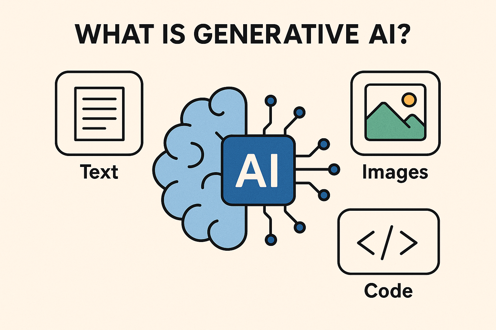
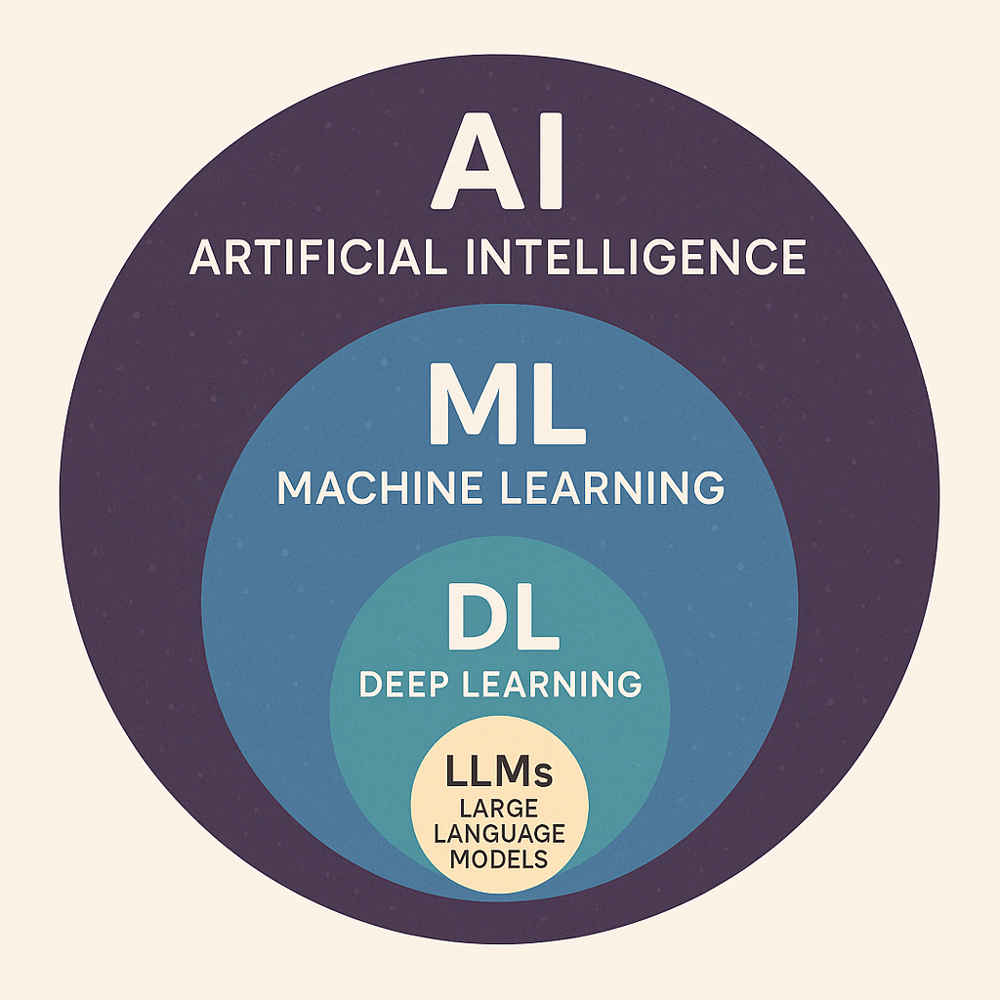
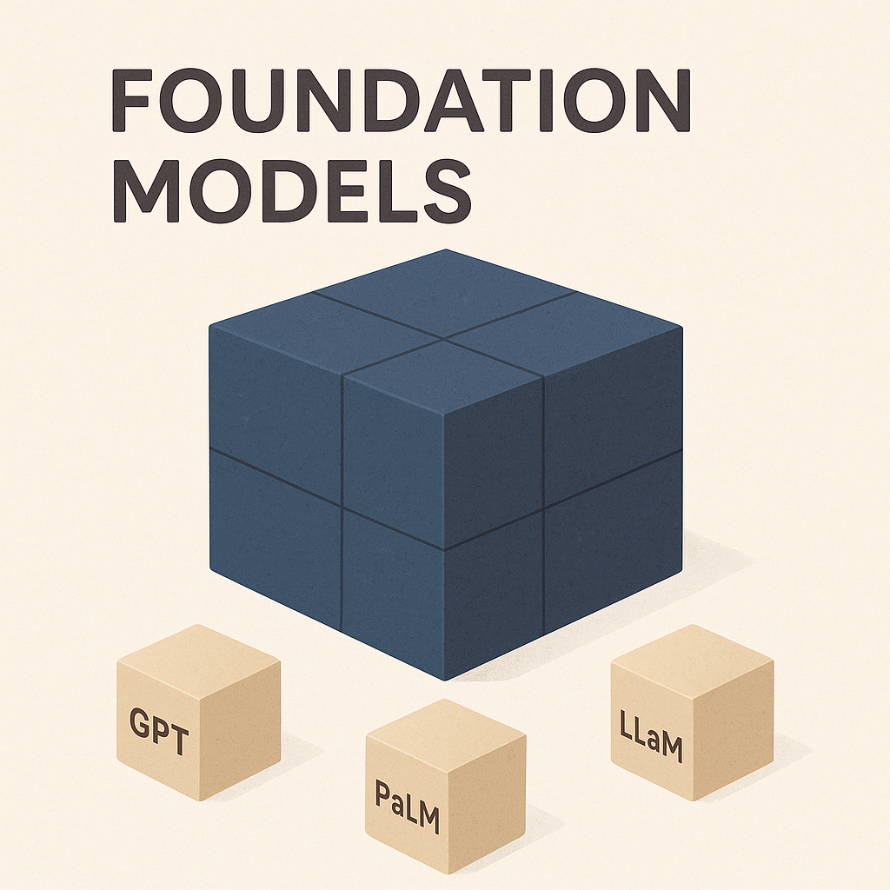
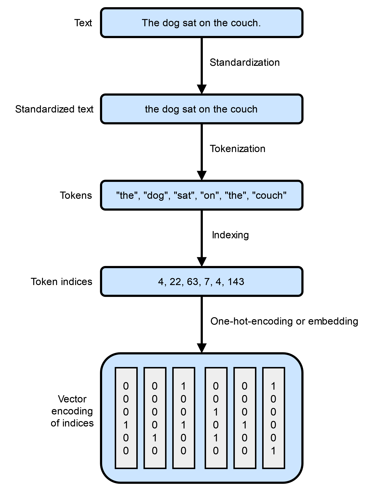
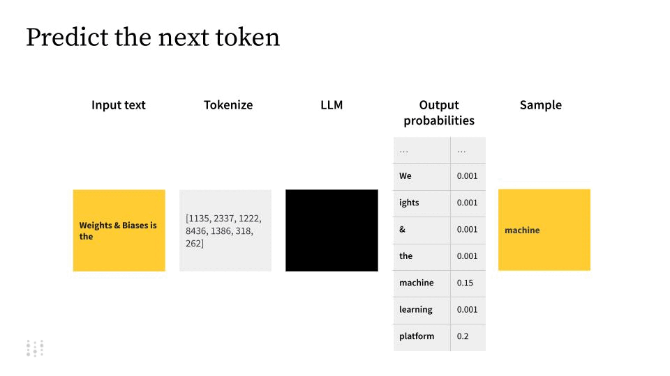

# 🕒 Day 6: Introduction to Generative AI (GenAI)

🏁 **Goal**: Understand the core concepts of Generative AI, LLMs, and their foundational technologies.

---

### ✅ 1. What is Generative AI? (5 mins)

* **Topics**:
    * Definition of GenAI
    * Key use cases
* **Summary**: Generative AI (GenAI) refers to AI systems that can create new content, such as text, images, or code, by learning from large datasets.
* **Prompt**: "GenAI enables machines to generate human-like content, opening new possibilities in creativity and automation."

---

### ✅ 2. AI, ML, Deep Learning, and LLMs: How Are They Related? (10 mins)

* **Topics**:
    * Artificial Intelligence (AI)
    * Machine Learning (ML)
    * Deep Learning (DL)
    * Large Language Models (LLMs)
* **Summary**: AI is the broad field; ML is a subset focused on learning from data; Deep Learning is a type of ML using neural networks; LLMs are deep learning models specialized for language.
* **Prompt**: "Think of AI as the universe, ML as a planet, Deep Learning as a continent, and LLMs as a city."

---

### ✅ 3. Foundation Models (5 mins)

* **Topics**:
    * What are foundation models?
    * Examples (GPT, PaLM, Llama, etc.)
* **Summary**: Foundation models are large, pre-trained models that serve as the base for many AI applications, including LLMs.
* **Prompt**: "Foundation models are the building blocks for modern AI applications."

---

### ✅ 4. LLMs, Small Language Models, and Variants (10 mins)

* **Topics**:
    * What is an LLM?
    * Small language models
    * Model variants (e.g., instruction-tuned, chat models)
* **Summary**: LLMs are large neural networks trained on vast text data; smaller models are optimized for specific tasks or efficiency.
* **Prompt**: "LLMs are like encyclopedias, while small models are like pocket guides."

---

### ✅ 5. How LLMs Work: Tokens, Embeddings, and Weights (10 mins)

* **Topics**:
    * Tokenization
    * Embeddings
    * Weights and relationships
* **Summary**: LLMs break text into tokens, convert them to embeddings (vectors), and use learned weights to find relationships and generate new text.
* **Prompt**: "LLMs turn words into numbers, numbers into meaning, and meaning into new words."

* **References**:
    - [The Art of Tokenization (towardsdatascience.com)](https://towardsdatascience.com/the-art-of-tokenization-breaking-down-text-for-ai-43c7bccaed25/)
    - [OpenAI Tokenizer Tool](https://platform.openai.com/tokenizer)
    - [TensorFlow Embedding Projector](https://projector.tensorflow.org/)

---

### ✅ 6. How GPT Predicts the Next Word (5 mins)

* **Topics**:
    * Next-word prediction
    * Attention mechanism
* **Summary**: GPT models predict the next word by analyzing context and using attention to weigh possible continuations.
* **Prompt**: "GPT reads your sentence, weighs every word, and picks the most likely next word."

* **Further Reading**: [A Gentle Introduction to LLM APIs (wandb.ai)](https://wandb.ai/darek/llmapps/reports/A-Gentle-Introduction-to-LLM-APIs--Vmlldzo0NjM0MTMz)

---

### ✅ 7. LLMs as Black Boxes (5 mins)

* **Topics**:
    * Why LLMs are considered black boxes
    * Interpretability challenges
* **Summary**: LLMs are complex and their internal workings are not fully understood, making them black boxes in many respects.
* **Prompt**: "We know what goes in and what comes out, but the middle is a mystery."

* **Reference**: [Hugging Face Transformers Documentation](https://huggingface.co/docs/transformers/en/index)
